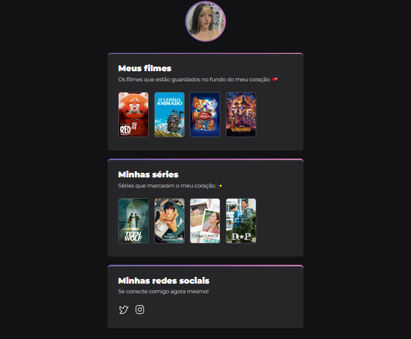

# NLW DESAFIO

>Desafio 

O projeto foi parte de um desafio da NLW.

[Clique aqui para acessar!](https://whoeduma.github.io/nlw-desafio-filmes/)

## ‼ Obstaculos/dificuldades que tive

- Para ser sincera a parte do CSS me estressou um pouco, é uma coisa que eu amo, mas as vezes é estressante e tive que ver os vídeos em algumas partes para ver no que estava errando.

- A parte da animação foi bem complicada, pois nunca mexi muito com animação, logo foi dificil entender. Porém acredito que se praticar muito, vou pegando a pratica.

- No fundo era para ter umas estrelas, porém eu não sei mesmo o que aconteceu que sumiu o background assim que coloquei aqui no github, olha que ja fui atras de tudo qualquer canto do codigo para ver o que estava errado.